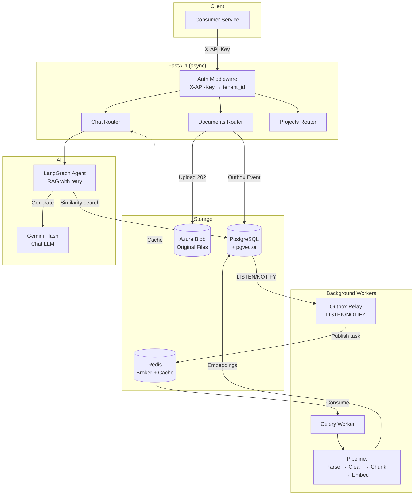

<p align="center">
  
  
  
  
  
  
</p>

# ⚡ FastDocs

> **Multi-tenant RAG microservice** that ingests documents, indexes them as vector embeddings, and answers natural language questions — all behind a simple API Key.

FastDocs is a production-grade Retrieval-Augmented Generation (RAG) service designed to be consumed by other applications. Each consumer (tenant) gets isolated document collections, chat threads, and query context — accessible through a single `X-API-Key` header.

---

## ✨ Key Features

| Feature | Description |
|---------|-------------|
| 🔐 **Multi-tenant isolation** | API Key auth with SHA-256 hashing. Tenants never see each other's data |
| 📄 **Multi-format ingestion** | PDF, DOCX, XLSX, CSV, TXT, MD, PPTX, and images out of the box |
| 🔍 **OCR support** | Auto-detects scanned PDFs and routes through Tesseract OCR |
| 🤖 **LangGraph RAG agent** | Intelligent retrieval with query reformulation and retry loops |
| 🧠 **pgvector** | Vector search in the same Postgres — no extra database to manage |
| ⚡ **Async pipeline** | Celery workers process documents in background; upload returns `202` immediately |
| 📬 **Outbox Pattern** | Transactional event publishing with Postgres `LISTEN/NOTIFY` — zero events lost |
| 💬 **Chat with history** | Threaded conversations with persistent state via LangGraph checkpointer |
| 🔄 **Streaming SSE** | Real-time responses via Server-Sent Events (`?stream=true`) |
| 🛡️ **Rate limiting** | Sliding window algorithm with Redis sorted sets per tenant/endpoint |
| 💾 **Query cache** | Redis-backed cache with automatic invalidation on new document ingestion |
| ☁️ **Azure-ready** | Azure Blob Storage for files (Azurite for local dev), designed for Azure deployment |

---

## 🏗️ Architecture



### Ingestion Flow

```
Upload → 202 Accepted
  → Outbox Event (atomic with document INSERT)
  → Relay publishes to Redis via LISTEN/NOTIFY
  → Celery Worker picks up task
  → Download from Blob → Parse → Clean → Chunk → Embed → pgvector
  → Webhook callback (if configured)
```

### Query Flow

```
POST /api/chat/message
  → Auth → tenant_id injected
  → LangGraph Agent:
      analyze_query → retrieve (pgvector) → evaluate_context
        ↓ sufficient?
        ├─ Yes → rerank → generate (Gemini Flash) → response
        └─ No  → reformulate query → retrieve again (max 2 retries)
  → Cache result in Redis (TTL 30min)
```

---

## 🛠️ Tech Stack

| Layer | Technology | Why |
|-------|-----------|-----|
| **API** | FastAPI + Pydantic v2 | Async native, robust validation, OpenAPI docs |
| **ORM** | SQLAlchemy 2.0 + Alembic | Type-safe async queries, versioned migrations |
| **Vectors** | pgvector (PostgreSQL 16) | No extra DB — relational + vector in one query |
| **RAG** | LangChain + LangGraph | Pipeline orchestration + stateful agent |
| **LLM** | Gemini Flash (`gemini-2.0-flash`) | Free tier, solid quality |
| **Tasks** | Celery + Redis | Reliable background processing with retries |
| **Storage** | Azure Blob (Azurite local) | Production-ready, Azure-native |
| **OCR** | Tesseract | Open source, local — no API costs |
| **Cache** | Redis | Query cache + rate limiting + Celery broker |

---

## 🚀 Quick Start

### Prerequisites

- [Docker](https://docs.docker.com/get-docker/) and Docker Compose
- A [Google AI API Key](https://aistudio.google.com/apikey) (Gemini)

### 1. Clone and configure

```bash
git clone https://github.com/TiagoAReiz/fastdocs.git
cd fastdocs

# Create environment file
cp backend/.env.example backend/.env
# Edit backend/.env and set your GOOGLE_API_KEY
```

### 2. Start all services

```bash
docker compose up --build
```

This starts **7 services**: FastAPI backend, Celery worker, Celery beat, Outbox relay, PostgreSQL (pgvector), Redis, and Azurite.

### 3. Verify

```bash
curl http://localhost:8000/docs
# → Swagger UI
```

---

## 📡 API Reference

All endpoints require the `X-API-Key` header for authentication.

### Projects

```bash
# Create a project (document collection)
curl -X POST http://localhost:8000/api/projects \
  -H "X-API-Key: fdocs_your_key_here" \
  -H "Content-Type: application/json" \
  -d '{"name": "Legal Documents"}'
```

### Documents

```bash
# Upload a document (returns 202 — processed async)
curl -X POST http://localhost:8000/api/documents/upload \
  -H "X-API-Key: fdocs_your_key_here" \
  -F "file=@contract.pdf" \
  -F "id_project=<project-uuid>"

# Check document status
curl http://localhost:8000/api/documents/<document-uuid> \
  -H "X-API-Key: fdocs_your_key_here"

# List all documents (paginated)
curl "http://localhost:8000/api/documents?page=1&page_size=20" \
  -H "X-API-Key: fdocs_your_key_here"
```

### Chat (RAG Query)

```bash
# Ask a question (full response)
curl -X POST http://localhost:8000/api/chat/message \
  -H "X-API-Key: fdocs_your_key_here" \
  -H "Content-Type: application/json" \
  -d '{
    "message": "What are the termination clauses?",
    "id_project": "<project-uuid>"
  }'

# Stream response (SSE)
curl -X POST http://localhost:8000/api/chat/message \
  -H "X-API-Key: fdocs_your_key_here" \
  -H "Content-Type: application/json" \
  -d '{
    "message": "Summarize the key points",
    "id_project": "<project-uuid>",
    "id_thread": "<thread-uuid>",
    "stream": true
  }'

# Get chat history
curl http://localhost:8000/api/chat/history \
  -H "X-API-Key: fdocs_your_key_here"
```

### Supported File Formats

| Format | Parser | Details |
|--------|--------|---------|
| `.pdf` | PyMuPDF + Tesseract | Auto-detects scanned pages |
| `.docx` | python-docx | Preserves heading hierarchy |
| `.xlsx` | openpyxl | One sheet = one document unit |
| `.csv` | pandas | Row-level semantic units |
| `.txt` | built-in | Direct text ingestion |
| `.md` | built-in | Markdown documents |
| `.pptx` | python-pptx | Slide-by-slide extraction |
| Images | Tesseract OCR | JPG, PNG, etc. |

---

## 📁 Project Structure

```
fastdocs/
├── docker-compose.yml          # All 7 services
├── azurite.Dockerfile          # Azure Blob emulator setup
│
└── backend/
    ├── Dockerfile
    ├── requirements.txt
    ├── .env.example
    │
    └── app/
        ├── main.py                     # FastAPI app + lifespan
        │
        ├── core/                       # Cross-cutting concerns
        │   ├── config.py               # Pydantic Settings
        │   ├── database.py             # Async SQLAlchemy engine
        │   ├── celery_app.py           # Celery configuration
        │   ├── redis.py                # Redis connection
        │   ├── storage.py              # Azure Blob init
        │   ├── llm.py                  # Gemini client
        │   └── graph/                  # LangGraph setup
        │       ├── state.py            # Agent state (TypedDict)
        │       └── checkpointer.py     # Persistent checkpointer
        │
        ├── models/                     # SQLAlchemy models
        │   ├── tenant.py
        │   ├── api_key.py
        │   ├── project.py
        │   ├── document.py
        │   ├── document_embedding.py   # pgvector
        │   ├── document_metadata.py
        │   ├── chat_thread.py
        │   ├── chat_message.py
        │   └── outbox_event.py
        │
        ├── schemas/                    # Pydantic DTOs
        ├── repositories/               # Data access (tenant-scoped)
        ├── services/                   # Business logic
        │   ├── chat_service.py
        │   ├── document_service.py
        │   ├── project_service.py
        │   ├── rag_graph.py            # LangGraph agent
        │   ├── ingestion_tasks.py      # Celery tasks
        │   ├── outbox_relay.py         # LISTEN/NOTIFY relay
        │   └── extraction/             # Document parsers
        │       ├── base.py             # Parser interface
        │       ├── registry.py         # Format → parser mapping
        │       ├── chunker.py          # Text splitting
        │       ├── pdf.py
        │       ├── docx.py
        │       ├── xlsx.py
        │       ├── csv.py
        │       ├── txt.py
        │       ├── md.py
        │       ├── pptx.py
        │       ├── image.py
        │       └── tabular.py
        │
        ├── routers/                    # API endpoints
        │   ├── deps.py                 # Auth dependencies
        │   ├── chat.py
        │   ├── documents.py
        │   └── projects.py
        │
        └── clients/                    # External service wrappers
            ├── blob_client.py
            ├── llm_client.py
            └── redis_client.py
```

---

## 🏛️ Architecture Decisions

| Decision | Alternative Considered | Rationale |
|----------|----------------------|-----------|
| **pgvector** in Postgres | Qdrant, Chroma, Pinecone | No extra service; relational + vector joins in one query |
| **Outbox Pattern** with LISTEN/NOTIFY | Direct Redis publish | Eliminates dual-write SPOF; events are never lost |
| **Celery** for background tasks | FastAPI BackgroundTasks | Tasks survive restarts; built-in retry and monitoring |
| **Tesseract** for OCR | Gemini Vision API | Zero API cost; runs locally; Vision as future fallback |
| **Azure Blob** (Azurite) | MinIO / S3 | Target deployment is Azure; Azurite provides local parity |
| **Exact query cache** | Semantic cache | Simpler; avoids false positive matches in v1 |
| **Sliding window** rate limiting | Token bucket | More precise; per-tenant granularity with Redis sorted sets |

---

## 🔒 Security

- **API Keys**: Generated with `secrets.token_urlsafe(32)`, prefixed `fdocs_`. Only the SHA-256 hash is stored — plaintext is shown once at creation
- **Tenant isolation**: Every query includes `WHERE tenant_id = ?` — enforced at the repository layer
- **Webhook signing**: `X-FastDocs-Signature: sha256=<hmac>` for callback verification
- **No secrets in repo**: `.env` is gitignored; `.env.example` provides the template

---

## 🗺️ Roadmap

### Done

- [x] Multi-tenant auth with API Keys (SHA-256 hashing, tenant isolation)
- [x] Document ingestion pipeline (PDF, DOCX, XLSX, CSV, TXT, MD, PPTX, images)
- [x] Scanned PDF auto-detection + Tesseract OCR (confidence filtering, language support)
- [x] Outbox Pattern with Postgres LISTEN/NOTIFY + fallback polling
- [x] LangGraph RAG agent (6 nodes: analyze, retrieve, evaluate, rerank, reformulate, generate)
- [x] Chat with threaded history and persistent state (LangGraph checkpointer)
- [x] SSE streaming responses (`stream=true`)
- [x] Rate limiting middleware (sliding window, Redis sorted sets, per-tenant/per-endpoint)
- [x] Query cache with Redis (TTL 30min, auto-invalidation on new document ingestion)
- [x] Webhook callbacks (HMAC-SHA256 signature, 3 retries with exponential backoff)
- [x] Celery Beat recovery (detects stuck documents in `processing` > 10min)
- [x] Docker Compose (7 services: API, worker, beat, relay, Postgres, Redis, Azurite)
- [x] Alembic migrations (initial schema + webhook fields)
- [x] Text cleaning pipeline (encoding normalization, dedup, header/footer filtering)
- [x] Document reprocessing endpoint (`POST /documents/{id}/reprocess`)

### To Do

- [ ] Admin API for tenant/key CRUD (currently requires direct DB access)
- [ ] Embedding model decision (currently Gemini API — planned: local model)
- [ ] Test suite (pytest) — test files exist but are stubs
- [ ] Structured logging with request correlation IDs
- [ ] CI/CD with GitHub Actions
- [ ] `.env.example` template file
- [ ] Observability (metrics endpoint, Prometheus)

---

## 📄 License

This project is for portfolio and educational purposes.

---

<p align="center">
  Built with ☕ by <a href="https://github.com/TiagoAReiz">Tiago Reiz</a>
</p>
